# Sobrio theme

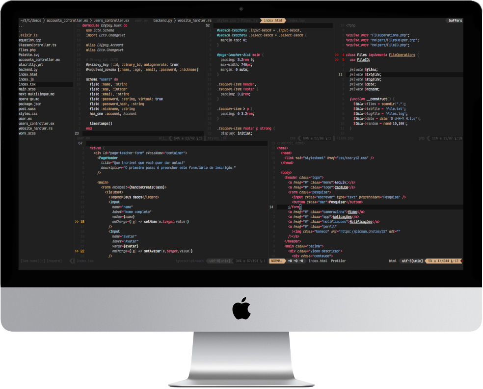

## About this theme

This is a theme for **Vim** and **Neovim**, with sober colors (at least for me), hence the name.
It has support for italic fonts, too. The font used in the screenshots is Victor Mono. At the moment, I only tested it in Neovim, but I think it should work with Vim as well. For the best experience, make sure your terminal supports at least 256 colors.

## Installation

To use it, follow these steps:

1. Copy the `colors/sobrio.vim` file to your NVIM colors directory, usually `~/.config/nvim/colors/`
2. Set the color scheme: `:colorscheme sobrio`.
3. ???
4. Profit!

## Setting it as your default

If you want to make it your default, just add this line to your `init.vim`:

```vim
colorscheme sobrio
```

## Screenshots

### HTML

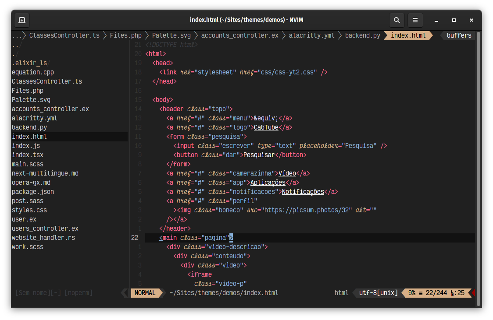

### JavaScript / Typescript

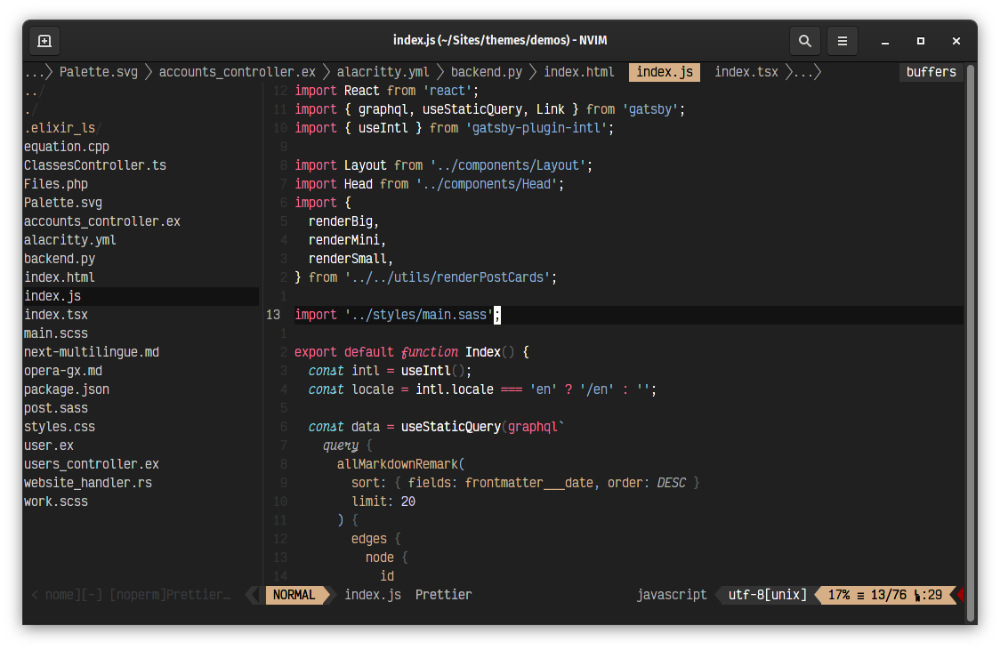

### React

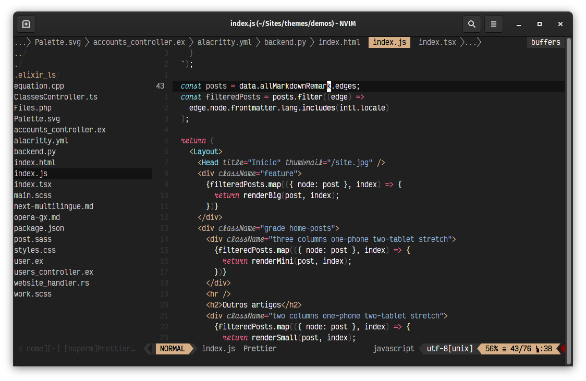

### CSS

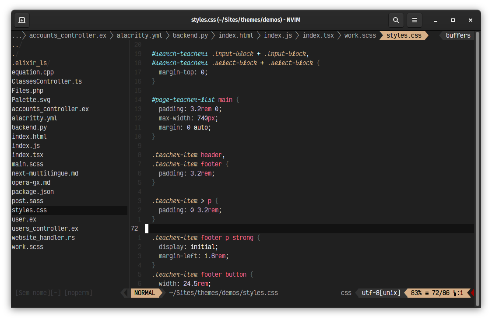

### SCSS

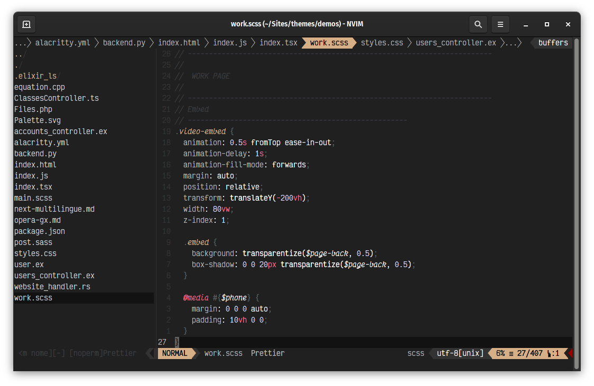

### Sass

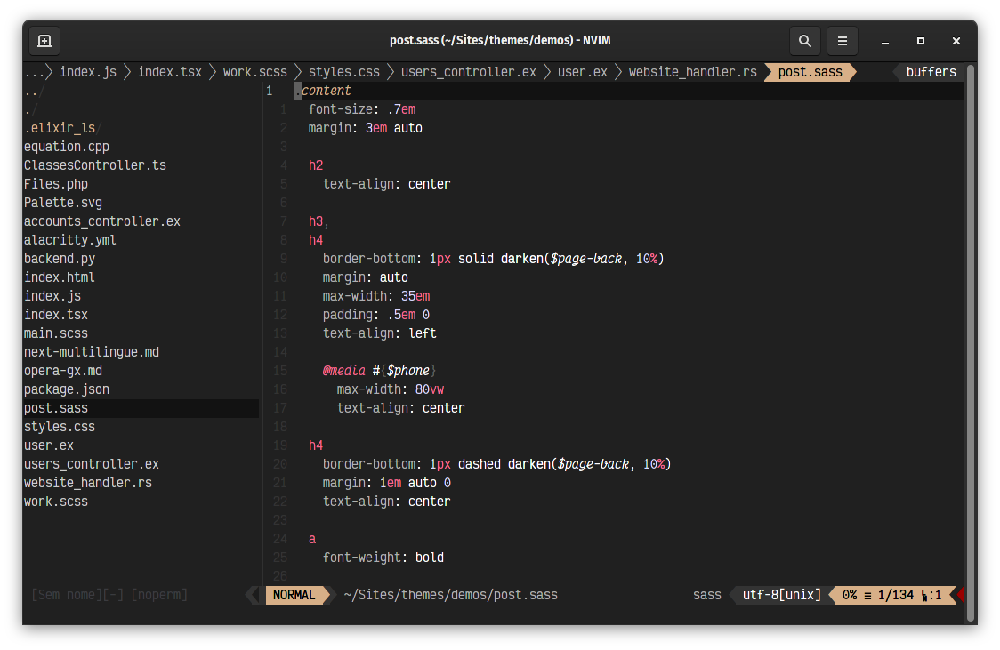

### SVG


### YAML

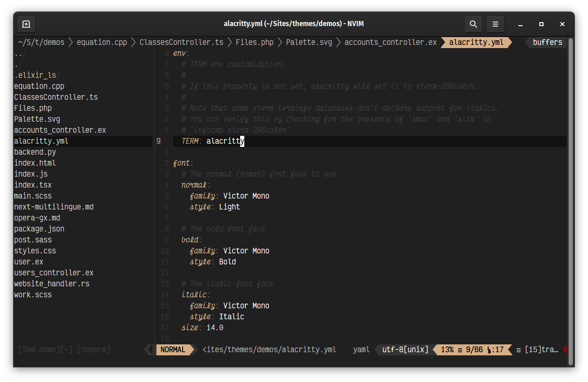

### JSON

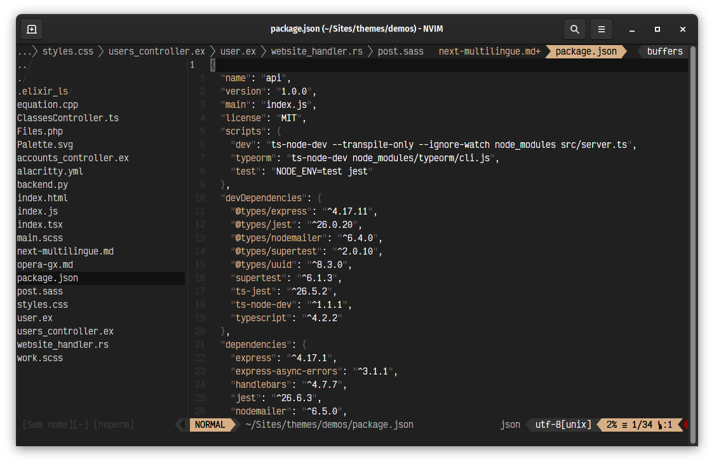

### Python

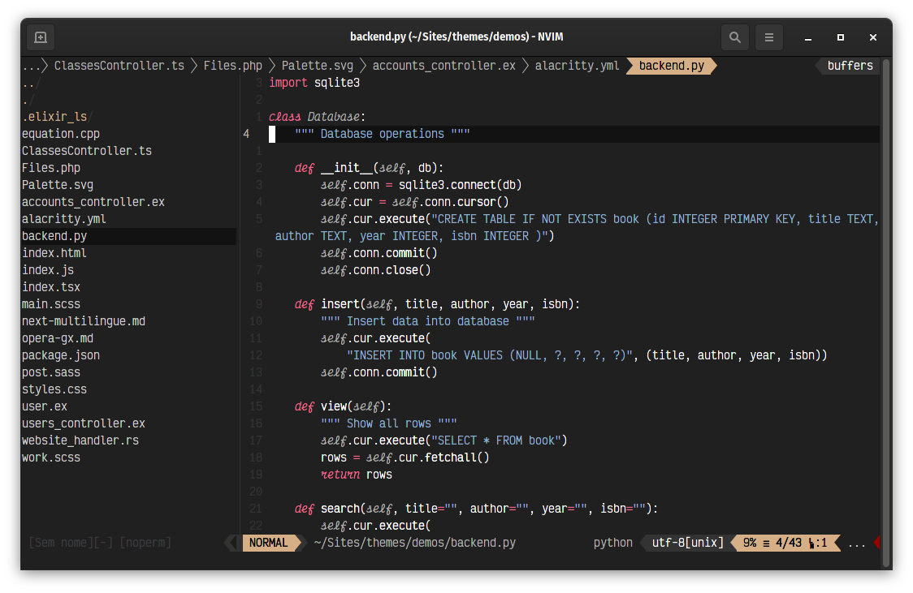

### PHP

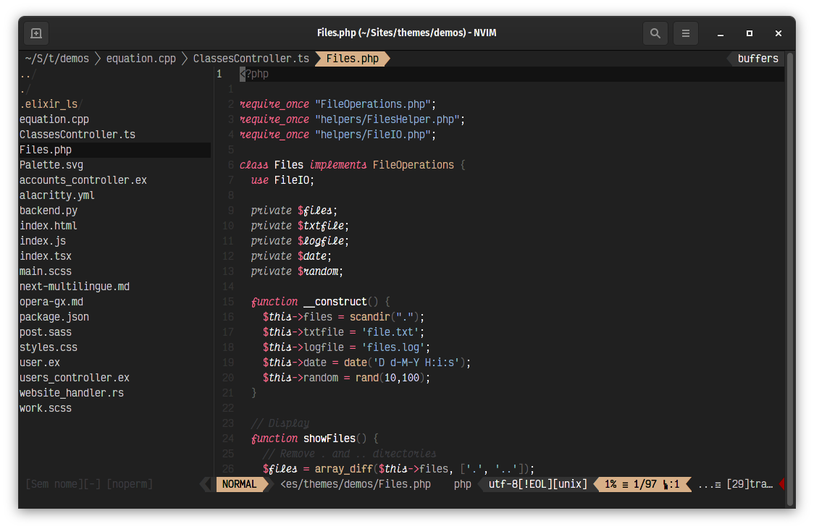

### Elixir


### Rust

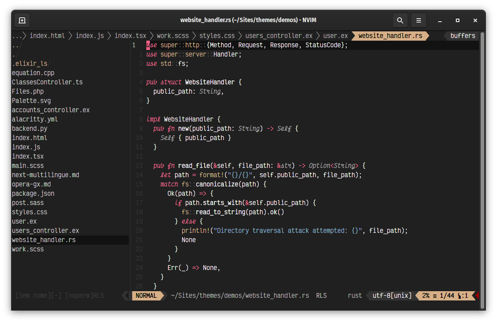

### C++

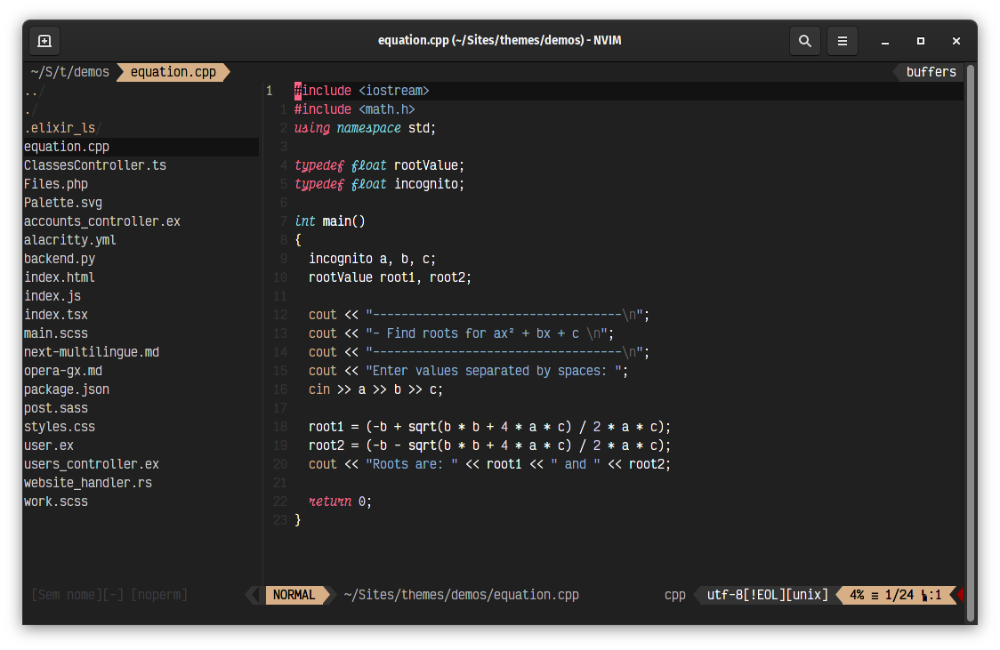

## Airline theme

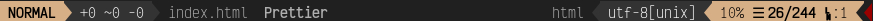


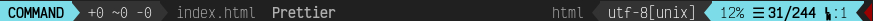


### Installation

1. Copy the `./autoload/airline/themessobrio.vim` file to your NVIM airline themes directory, usually `~/.config/nvim/autoload/airline/themes/`
2. Set the color scheme: `:AirlineTheme sobrio`.

### Setting it as your default

If you want to make your default Airline theme, add this to your `init.vim`:

```vim
let g:airline_theme='sobrio'
```

Take cake!
